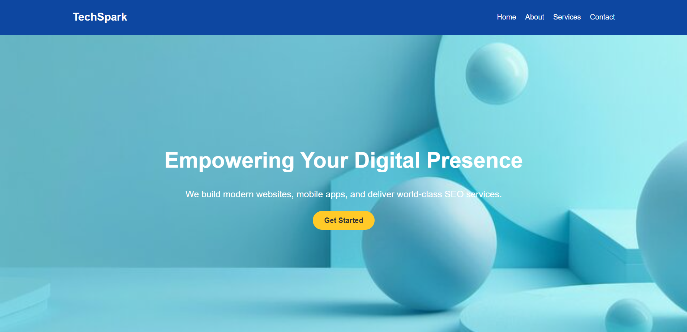

# 🌐 Professional Landing Page
 <!-- Optional: Add a custom banner image here -->

> **Internship Project | ApexPlanet Software Pvt. Ltd.**

This is a **responsive landing page** created using **HTML, CSS, and JavaScript** as part of **Task 1** of a 45-day Web Development Internship. While this task is meant to apply basic concepts, I’ve elevated it with a **clean UI**, **responsive design**, and **real-world project structure**.

---

## 🔥 Features

- Professional UI/UX structure
- Responsive layout using **Flexbox**
- Modern HTML5 semantic elements
- Organized external **CSS and JS** files
- Interactive contact form using basic **JavaScript DOM**
- Cross-browser support
- Fully deployable with GitHub Pages

---

## 📂 Folder Structure
professional-landing-page/ 

- ├── index.html   
- ├── css/styles.css  
- ├── js/main.js  
- ├── images/(all image assets)  
- ├── README.md  
---

## 🚀 Live Preview

🔗 [View Live Website](https://purnabratapanja.github.io/Basic-landing-page/)

---

## 💡 Tech Stack

- HTML5
- CSS3 (Flexbox, Media Queries)
- JavaScript (DOM manipulation)

---

## 🎓 About This Internship

This project was developed as part of a **Web Development Internship Program** conducted by **ApexPlanet Software Pvt. Ltd.**, offered via the **AICTE Internship Portal**.  
It showcases the foundational skills of modern web design — setting the stage for more advanced full-stack development tasks ahead.

---

## 📬 Contact Me

- 🔗 [LinkedIn](https://www.linkedin.com/in/purnabratapanja/)
- 📧 purnapanja38@gmail.com

---

> ⭐ *Thank you for checking out my project! Stay tuned for upcoming projects in this internship series.*

